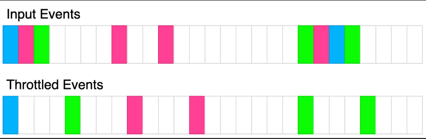

# Time (setTimeout) : Throttle

Given a function fn and a time in milliseconds t, return a throttled version of that function.

A throttled function is first called without delay and then, for a time interval of t milliseconds, can't be executed but should store the latest function arguments provided to call fn with them after the end of the delay.

For instance, t = 50ms, and the function was called at 30ms, 40ms, and 60ms. The first function call would block calling functions for the following t milliseconds. The second function call would save arguments, and the third call arguments should overwrite currently stored arguments from the second call because the second and third calls are called before 80ms. Once the delay has passed, the throttled function should be called with the latest arguments provided during the delay period, and it should also create another delay period of 80ms + t.



The above diagram shows how throttle will transform events. Each rectangle represents 100ms and the throttle time is 400ms. Each color represents a different set of inputs.

```javascript
/**
 * @param {Function} fn
 * @param {number} t
 * @return {Function}
 */
var throttle = function(fn, t) {
  return function(...args) {

  }
};

/**
 * const throttled = throttle(console.log, 100);
 * throttled("log"); // logged immediately.
 * throttled("log"); // logged at t=100ms.
 */
```

```typescript
type F = (...args: any[]) => void

function throttle(fn: F, t: number): F {
  return function (...args) {

  }
};

/**
 * const throttled = throttle(console.log, 100);
 * throttled("log"); // logged immediately.
 * throttled("log"); // logged at t=100ms.
 */
```